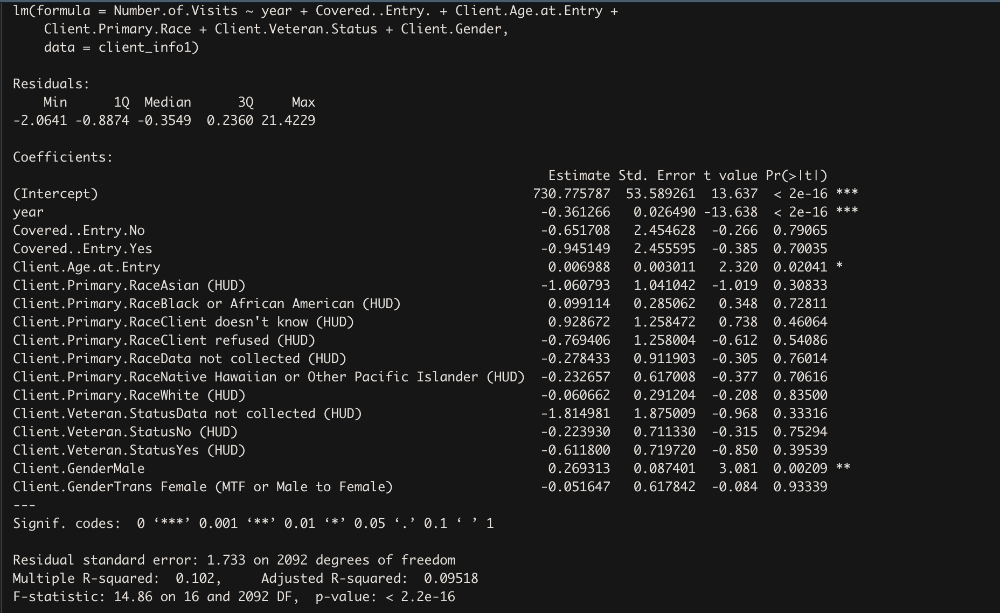

```{r setup, include=FALSE}
knitr::opts_chunk$set(echo = TRUE)
```
# Background and data source
Urban Ministries of Durham (UMD) is a private, non-profit organization that aims to prevent homelessness and support the needs of very poor and hungry neighbors. The dataset consists of information on what type of services UMD provides and some demographic information on clients.

The original datasets and few generated datasets during the data processing are available here: https://github.com/datasci611/bios611-projects-fall-2019-Quanbaby/tree/master/project_3/data


# Purpose of the project

1. Summary Statistics on the clients of Urban Ministries of Durham 
2. Explore if there exists correlations between variables and the number of visits 
3. Explore the relationship between the past couple of years and the number of visits 


# Part 1: Summary Statistics on the clients of Urban Ministries of Durham 
```{r, echo=FALSE, message=FALSE, warning=FALSE}
library(tidyverse)
library(ggplot2)

#import the Data

client_info <- read.csv("../data/final_project.csv",sep = ",",na.strings=c("","NA"))


library(plyr)
# Plot the client's age for different genders 
mu <- ddply(client_info, "Client.Gender", summarise, grp.mean=mean(Client.Age.at.Entry))

# used to identify the number of females, males, and trans female
#Gender=client_info$Client.Gender
#as.data.frame(table(Gender))

ggplot(client_info, aes(x=Client.Age.at.Entry, color=Client.Gender)) + 
  geom_histogram(fill="white", position="dodge", na.rm = TRUE) +
  geom_vline(data=mu[-4,], aes(xintercept=grp.mean, color=Client.Gender), linetype="dashed") + 
  labs(title="Histogram of Client Age", x="Client Age", y="Count",color='Gender') +
  theme_classic() +
  theme(plot.title = element_text(hjust = 0.5)) +
  scale_color_manual(labels=c("Female (656)", "Male (1697)", "Trans Female (8)"), 
                              values=c("red", "blue","black"))
ggsave("../results/histogram_age.png", width = 6, height = 4)

```
  
  From this plot, it is evident that there are far more male clients than female clients from the UMD. There are three type of gender in our category, female, male and trans female (male to female). The most interesting part of the plot is that the distributions for both female and male clients are bimodal. The first peak tends to be around age 30 and the second peak is approximately around age 50 for both males and females. Since there are only 8 trans clients, it is difficult to find the distribution of trans females. The mean age for female is approximately 42, and the mean age for male is approximately 44. 

```{r, echo=FALSE, message=FALSE, warning=FALSE}
#frequency table by year  

year=client_info$year
as.data.frame(table(year))
```
  
  The above dataset shows the number of clients from 2000 to 2019. From 2012, the number of clients increase to 12. UMD served the most number of clients in 2016, with 531 clients. Since 2016, the number of clients have declined. 

```{r, echo=FALSE, message=FALSE, warning=FALSE}
#Summary statistics on clients veteran status, race, and health 

library(magrittr)
#library(qwraps2)

vet=client_info$Client.Veteran.Status
table(vet)
race= client_info$Client.Primary.Race
as.data.frame(table(race))
healthinsurance=client_info$Covered..Entry.
as.data.frame(table(healthinsurance))


```
  
  There are 275 veterans and 1905 non-veterans. 
  Most of the clients' are African Americans, followed by White Americans, and Native Americans. 
  More than half of the clients do not have health insurance. 


# Part 2: Explore the possibility of correlations between variables and the number of visits
```{r, echo=FALSE, message=FALSE, warning=FALSE}
#boxplot on visits  

  ggplot(client_info, aes(x="", y=client_info$Number.of.Visits)) +
  geom_boxplot() + 
  labs(title="Boxplot of Number of Visits", x="Client", y="Number of Visits") +
  theme_classic() +
  theme(plot.title = element_text(hjust = 0.5)) 
 
  ggsave("../results/boxplot_visits.png", width = 6, height = 4)
```
  
  From this boxplot, we can see that the minimum number of visits is 1 and the maximum number of visits is 24. There are many outliers and the 3rd quartile is 2 visits. Thus approximately 75% of the clients visits the UMD at most 2 times. There are many outliers in this boxplot. So I proceed to find out what distinguishes these outliers from the rest. I decided to what variables might be correlated with the number of visits. 

```{r, echo=FALSE, message=FALSE, warning=FALSE}
#boxplot on race vs. visits


client_info %>% filter(is.na(Client.Primary.Race) == FALSE) %>%
  ggplot( aes(x=Client.Primary.Race, y=Number.of.Visits, color=Client.Primary.Race)) +
     geom_boxplot()  + 
  scale_x_discrete(labels=c("American Indian or Alaska Native (HUD)" = "AI/AN", 
                            "Asian (HUD)" = "Asian",
                            "Black or African American (HUD)" = "AA",
                            "Client doesn't know (HUD)" = "DK",
                            "Client refused (HUD)" = "R",
                            "Data not collected (HUD)" = "N",
                            "Native Hawaiian or Other Pacific Islander (HUD)" = "NH/OPI",
                            "White (HUD)" = "C")) +
  scale_color_manual(labels=c("AI/AN = American Indian or Alaska Native", 
                              "Asian = Asian", 
                              "AA = African America",
                              "DK = Client Doesn't Know",
                              "R = Client Refused", 
                              "N = Data Not Collected", 
                              "NH/OPI = Native Hawaiian or Other Pacific Islander", 
                              "C = Caucasian"
                              ), 
                              values=c("#b2182b", "#d6604d","#f4a582", "#fddbc7", 
                                       "#d1e5f0", "#92c5de", "#4393c3", "#2166ac")) + 
  labs(title="Boxplot of Race vs. Number of Visits", x="Client Race", 
            y="Number of Visits") +
  theme_classic() +
   theme(plot.title = element_text(hjust = 0.5))

ggsave(filename = "../results/boxplot_race_visits.png", width = 6, height = 4)


```
  
  From this boxplot, the median number of visits for any of the race is either 1 or 2 visits. The outliers reside in the the race group of Native Americans, African Americans, and Caucasians, and these three categories make up more than 90% of the clients. Thus I conclude that Race is not correlated with Number of Visits. 


```{r, echo=FALSE, message=FALSE, warning=FALSE}
#boxplots on veteran vs. visits

client_info %>% filter(is.na(Client.Veteran.Status) == FALSE) %>%
  ggplot( aes(x=Client.Veteran.Status, y=Number.of.Visits, color=Client.Veteran.Status)) +
  geom_boxplot() +
  scale_x_discrete(labels=c("Data not collected (HUD)" = "Data Not Collected",
                            "No (HUD)" = "No",
                            "Yes (HUD)" = "Yes")) +
  scale_color_manual(labels=c("Data Not Collected", 
                              "No",
                              "Yes"), 
                              values=c("#66c2a5", "#fc8d62","#8da0cb")) + 
  labs(title="Boxplot of Veteran Status vs. Number of Visits", x="Veteran Status", 
            y="Number of Visits") +
  theme_classic() +
   theme(plot.title = element_text(hjust = 0.5))

ggsave(filename = "../results/boxplot_veteran_visits.png", width = 6, height = 4)


```
  
  The outliers are equally distributed from from both clients have and don't have veteran status. 


```{r, echo=FALSE, message=FALSE, warning=FALSE}
#boxplots on health insurance and visits

client_info %>% filter(is.na(client_info$Covered..Entry.) == FALSE) %>%
ggplot(aes(x=Covered..Entry., y=Number.of.Visits, color=Covered..Entry.)) +
  geom_boxplot() +
  labs(title="Boxplot of Health Insurance vs. Number of Visits", x="Health Insurance Status", 
            y="Number of Visits") +
  theme_classic() +
   theme(plot.title = element_text(hjust = 0.5))

ggsave(filename = "../results/boxplot_health_visits.png", width = 8, height = 4)

```
  The outliers reside in both the clients who have health insurance and those who do not have health insurance. 
```{r, echo=FALSE, message=FALSE, warning=FALSE}
#boxplots on gender and visits

client_info %>% filter(is.na(Client.Gender) == FALSE) %>%
ggplot(aes(x=Client.Gender, y=Number.of.Visits, color=Client.Gender)) +
   geom_boxplot()+
  scale_x_discrete(labels=c("Female" = "Female",
                            "Male" = "Male",
                            "Trans Female (MTF or Male to Female)" = "Trans Female")) +
  scale_color_manual(labels=c("Female", 
                              "Male",
                              "Trans Female"), 
                              values=c("#66c2a5", "#fc8d62","#8da0cb")) + 
  labs(title="Boxplot of Gender vs. Number of Visits", x="Gender", 
            y="Number of Visits") +
  theme_classic() +
   theme(plot.title = element_text(hjust = 0.5))

ggsave(filename = "../results/boxplot_gender_visits.png", width = 6, height = 4)


```
  
  The outliers are from both female and male clients of UMD. Therefore, we can't conclude that gender is directly associated with number of visits. 

```{r, echo=FALSE, message=FALSE, warning=FALSE}
# boxplots on year and visits

client_info[,13] <- sapply(client_info[, 13], as.character)
client_info %>% filter(is.na(year) == FALSE) %>%
ggplot(aes(x=year, y=Number.of.Visits)) +
   geom_boxplot()  + 
  labs(title="Boxplot of Year of Entry vs. Number of Visits", x="Year", 
            y="Number of Visits") +
  theme_classic() +
   theme(plot.title = element_text(hjust = 0.5))

ggsave(filename = "../results/boxplot_year_visits.png", width = 6, height = 4)


```
  
  From the boxplots, we can see that most of the outliers are from year 2013 and on, which is predictable since most of clients are from year 2013 and on. It seems that there is a trend that the number of clients who frequently visited (>2) UMD has been decreasing starting from 2015. So I suspect that there may be some correlation between the recent years and the number of visit. 
  
# Part 3 Explore the relationship between the past couple of years and the number of visits 
```{r, echo=FALSE, message=FALSE, warning=FALSE}
#scatterplots on year vs. visits

client_info1 <- read.csv("../data/final_project1.csv",sep = ",")

ggplot(client_info1, aes(x=year, y=client_info1$Number.of.Visits)) + geom_point()+ geom_jitter() + geom_smooth(method=lm, se=TRUE, fullrange=FALSE, level=0.95) + 
  labs(title="Scatterplot of Year of Entry vs. Number of Visits", x="Year", 
            y="Number of Visits") +
  theme_classic() +
   theme(plot.title = element_text(hjust = 0.5))


ggsave(filename = "../results/scatter_year_visits.png", width = 6, height = 4)

```
  From the scatterplot, we can see that number of visits have decreased over the years. However, more analysis is necessary to say if this decrease in the number of visits in the recent year is actually significant. So I decided to fit a linear model to see if the decrease is actually significant. 


```{r, echo=FALSE, message=FALSE, warning=FALSE, results="hide"}
#fit a model and find the p-value


summary(lm(Number.of.Visits ~ year+Covered..Entry.+Client.Age.at.Entry+Client.Primary.Race+Client.Veteran.Status+Client.Gender,
           data=client_info1))

```

  
  The Linear model that I fitted consist of six explanatory variables, which are year, insurance, age, race, veteran status, and gender. Of all the variables I've fitted in the model, year, age, and gender have a significant affect on the number of visits in the last 6 years. Furthermore, since the coefficient associated with the variable year is negative, we can conclude that as the year increases, the number of visit decreases. 
  
#Conclusion 
  
  1. UMD has more male than female clients. 
  2. Most clients are African Americans, followed by White Americans. 
  3. Approximately 57% of the clients do not have Health Insurance. 
  4. Majority of the clients only visit UMD once or twice. 
  5. The number of visits is not directly correlated with gender, veteran status, race, and insurance status. 
  6. The number of visits have significantly decreased in the recent 6 years. 
  7. Year, age, and gender have a significant affect on the number of visits in the last 6 years.
  

